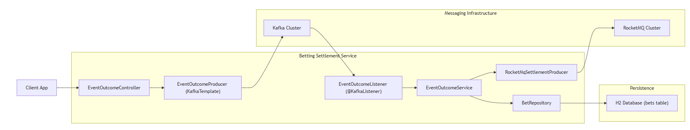

# Betting Settlement Service

A backend service simulating sports event outcome handling and bet settlement using **Kafka** and **RocketMQ**, built with Java 21 and Spring Boot 3 in a clean, layered architecture.

## 📦 High-Level Component Diagram



## 🧱 Architecture Overview

The application adopts a clean, layered architecture (Controller → Service → Domain → Infrastructure) to enhance maintainability, scalability, and clarity:

### 1. **API Layer**

* **EventOutcomeController** provides a REST API endpoint:

   * `POST /api/v1/events/outcomes`
* Delegates processing to **EventOutcomeProducer**, which asynchronously publishes `EventOutcomeDto` events to Kafka.

### 2. **Kafka Layer**

* **Producer**: Wraps Spring’s `KafkaTemplate`, publishing to the `event-outcomes` topic.
* **Consumer**: Uses `@KafkaListener` within **EventOutcomeListener** to consume messages from the `event-outcomes` topic and forward them to the core service.

### 3. **Core Service**

* **EventOutcomeService** (`@Transactional`):

   1. Retrieves relevant bets by `eventId` from `BetRepository`.
   2. Send settlement messages (`BetSettlementDto`) via RocketMQ.

### 4. **RocketMQ Layer**

* **RocketMqSettlementProducer**: Manages message serialization and sending via `DefaultMQProducer`:

   * Configured with robust timeout and retry policies.
   * Sends serialized `BetSettlementDto` messages to the `bet-settlements` topic for downstream processing (e.g., financial settlement, user notifications).

### 5. **Persistence Layer**

* Uses an **H2** database (file-based or in-memory) containing the `bets` table.
* Indexed columns, including `event_id`, for efficient querying.
* Schema consistency is maintained with Flyway migrations.

### 6. **DevOps & CI**

* **Docker-Compose** for local development:

   * Orchestrates Kafka (KRaft mode), RocketMQ (NameServer & Broker), and the Spring Boot application.
* **GitHub Actions** for continuous integration:

   * Executes tests via `mvn test` and generates detailed JUnit reports with `dorny/test-reporter`.

### **Non-functional Highlights**

* **Idempotency**: Ensured by message key `(eventId, betId)` to safely handle Kafka message replays.
* **Scalability**: Independently scalable Kafka consumers and RocketMQ brokers.
* **Extensibility**: Allows new downstream services to seamlessly subscribe to the `bet-settlements` topic for further processing.


## 📂 Current Project Structure

```text
src/
├── main/
│   ├── java/com/sporty/betting_settlement_service/
│   │   ├── api/
│   │   │   ├── controller      # REST controllers (inbound adapters)
│   │   │   └── dto             # Data Transfer Objects
│   │   ├── application/
│   │   │   └── service         # Business use-case implementations
│   │   ├── domain/
│   │   │   └── model           # Core business entities
│   │   └── infrastructure/
│   │       ├── kafka/
│   │       │   ├── config      # Kafka producer/consumer configs
│   │       │   ├── consumer    # Kafka listeners
│   │       │   └── producer    # Kafka publishers
│   │       ├── repository      # Spring Data JPA repositories
│   │       └── rocketmq/       # RocketMQ producers
│   └── resources/
│       ├── application-*.properties
│       └── db/
│           ├── migration       # Flyway SQL migrations
│           └── testdata        # SQL seeds for integration tests
└── test/
    └── java/...                # Integration and unit tests
```

## 🔎 Layer Responsibilities

### 1. API Layer (`api/`)

* **`controller/`**: Defines REST endpoints. Example: `EventOutcomeController` receives HTTP requests and invokes application services.
* **`dto/`**: Payload objects for request/response, decoupling domain entities from external representation.

### 2. Application Layer (`application/service/`)

* Implements business use cases. Contains orchestration logic, coordinates between domain models and infrastructure.
* Example: `EventOutcomeService` matches bets in-memory and delegates persistence or messaging.

### 3. Domain Layer (`domain/model/`)

* Core business entities and value objects. Example: `Bet.java` represents a bet placed by a user.
* Contains pure domain logic free of I/O or framework dependencies.

### 4. Infrastructure Layer (`infrastructure/`)

* **`kafka/config/`**: KafkaProducerConfig and KafkaConsumerConfig for setting up topics, serializers, consumer factories.
* **`kafka/consumer/`**: Listeners (e.g. `EventOutcomeListener`) that consume messages and invoke domain logic.
* **`kafka/producer/`**: Producers (e.g. `EventOutcomeProducer`) that publish messages to Kafka topics.
* **`rocketmq/`**: RocketMQ producer implementation (`RocketMqSettlementProducer`) for bet settlement events.
* **`repository/`**: Spring Data JPA interfaces (e.g. `BetRepository`) for database interactions.

### 5. Database Migrations & Test Data

* **`db/migration/`**: Flyway migration scripts (`V1__init_bets_table.sql`).
* **`db/testdata/`**: SQL seed scripts (`V2__insert_mock_bets.sql`) used for integration tests.

### 6. Testing (`test/`)

* **Unit Tests** mock dependencies to verify individual components.
* **Integration Tests** spin up Spring context and embedded DB to validate end-to-end flows (e.g. `BettingSettlementServiceApplicationTests`).

## 🛠️ Future Extensions

When you need to introduce new use cases or external integrations:

1. **New Use Case Service**

    * Create a new service class in `application/service/` implementing the business logic.
    * Define corresponding DTOs and controller endpoints in `api/controller` and `api/dto`.

2. **Database Schema Changes**

    * Add a Flyway migration in `resources/db/migration/` (e.g. `V3__create_refunds_table.sql`).
    * Provide test seed data in `resources/db/testdata/`.

3. **Additional Messaging Adapters**

    * For Kafka: add new listener in `infrastructure/kafka/consumer` or producer in `infrastructure/kafka/producer`.
    * For RocketMQ: add new producer or consumer under `infrastructure/rocketmq/`.

4. **New Persistence Repositories**

    * Define Spring Data interfaces in `infrastructure/repository/` alongside your entities.

## ✅ Features

* **REST API** to publish sports event outcomes.
* **Kafka** producer/consumer for event outcomes.
* **In-memory bet matching** logic.
* **RocketMQ** producer for bet settlements.
* **Layered architecture** with a clear separation of concerns.

## 🚀 Getting Started

### Prerequisites

* Docker
* Docker Compose

### Build & Run

```bash
docker compose -f .\docker-compose.yml up -d --build
```

1. Application available at `http://localhost:8080`.
2. Kafka and RocketMQ services running locally.

### API Example

```http
POST http://localhost:8080/api/v1/events/outcomes
Content-Type: application/json

{
  "eventId": "E123",
  "eventName": "Team A vs Team B",
  "eventWinnerId": "TeamA"
}
```

### Verify

1. Inspect Kafka topic `event-outcomes`.
2. Observe in-memory matching logs in service output.
3. Check RocketMQ topic `bet-settlements`.
